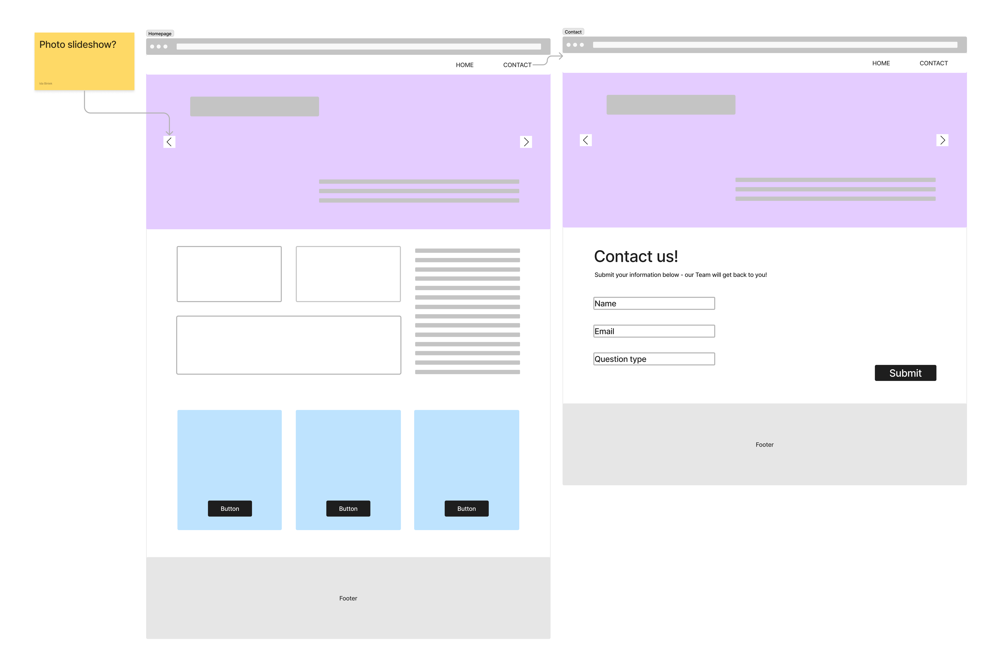

# CFG Web Dev Group Project

## Team: 
* Ida Biniek 
* Sisi Wang

The following **‘MUST HAVE’  REQUIREMENTS** is completed:

- [x] **A minimum of 2 HTML web pages and one external CSS file **
- [x] **A website wireframe **
- [x] **Use a CSS framework (we will be viewing one in Week 4 of the course)**
- [x] **All links working **
- [x] **Basic user interaction (Ex: hover, submit form, action on click) **
- [x] **Adhering to UI/UX rules **

‘NICE TO HAVE’ REQUIREMENTS
- [ ] All of the ‘Must Have criteria’
- [ ] Mobile responsive website
- [ ] Effective use of classes and IDs
- [ ] JavaScript used to enable user interaction 

## website wireframe

## Video Walkthrough

Will add recorded video/gif here

    

## License

    Copyright [2024] [Sisi Wang]

    Licensed under the Apache License, Version 2.0 (the "License");
    you may not use this file except in compliance with the License.
    You may obtain a copy of the License at

        http://www.apache.org/licenses/LICENSE-2.0

    Unless required by applicable law or agreed to in writing, software
    distributed under the License is distributed on an "AS IS" BASIS,
    WITHOUT WARRANTIES OR CONDITIONS OF ANY KIND, either express or implied.
    See the License for the specific language governing permissions and
    limitations under the License.
